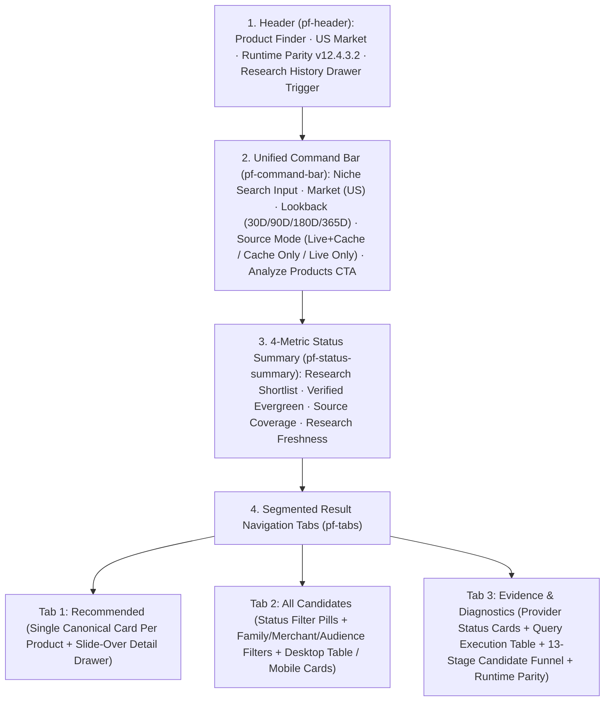

# SWAI KH-02 V12.4.3.2 — Product Finder Information Architecture

```mermaid
flowchart TD
  H["1. Header (pf-header): Product Finder · US Market · Runtime Parity v12.4.3.2 · Research History Drawer Trigger"]
  C["2. Unified Command Bar (pf-command-bar): Niche Search Input · Market (US) · Lookback (30D/90D/180D/365D) · Source Mode (Live+Cache / Cache Only / Live Only) · Analyze Products CTA"]
  S["3. 4-Metric Status Summary (pf-status-summary): Research Shortlist · Verified Evergreen · Source Coverage · Research Freshness"]
  T["4. Segmented Result Navigation Tabs (pf-tabs)"]
  T1["Tab 1: Recommended (Single Canonical Card Per Product + Slide-Over Detail Drawer)"]
  T2["Tab 2: All Candidates (Status Filter Pills + Family/Merchant/Audience Filters + Desktop Table / Mobile Cards)"]
  T3["Tab 3: Evidence & Diagnostics (Provider Status Cards + Query Execution Table + 13-Stage Candidate Funnel + Runtime Parity)"]

  H --> C --> S --> T
  T --> T1
  T --> T2
  T --> T3
```
